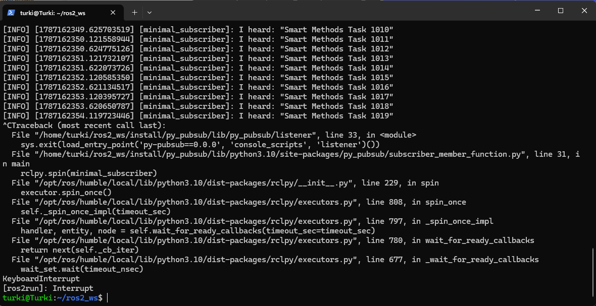
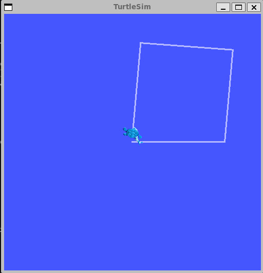

# ROS2 Publisher Subscriber & Turtle Square

## Description

This project demonstrates basic ROS 2 concepts using Python.

The project includes:

* A **Publisher (Talker)** that sends a custom message instead of "Hello World".
* A **Subscriber (Listener)** that receives and displays the published message.
* A **Turtlesim controller** that moves the turtle in a square path instead of a circle.

## Requirements

* Ubuntu 22.04
* ROS 2 Humble
* Python 3
* Turtlesim

## Part 1: Publisher and Subscriber

The Publisher sends a custom message:

```text
Smart Methods Task
```

The Listener receives and displays the message:

```text
I heard: "Smart Methods Task"
```

### Run the Publisher

```bash
source /opt/ros/humble/setup.bash
source ~/ros2_ws/install/setup.bash
ros2 run py_pubsub talker
```

### Run the Listener

Open another terminal:

```bash
source /opt/ros/humble/setup.bash
source ~/ros2_ws/install/setup.bash
ros2 run py_pubsub listener
```

### Publisher & Subscriber Result



## Part 2: Turtle Square Movement

The Turtlesim code was modified to make the turtle move in a square path instead of a circle.

The turtle:

1. Moves forward.
2. Turns 90 degrees.
3. Repeats the movement four times.
4. Stops after completing the square.

### Run Turtlesim

```bash
source /opt/ros/humble/setup.bash
ros2 run turtlesim turtlesim_node
```

### Run the Square Controller

Open another terminal:

```bash
source /opt/ros/humble/setup.bash
source ~/ros2_ws/install/setup.bash
ros2 run turtle_square square
```

After completing the square, the terminal displays:

```text
Square completed!
```

### Turtle Square Result



## Project Structure

```text
ros2_ws/
└── src/
    ├── py_pubsub/
    │   └── py_pubsub/
    │       ├── publisher_member_function.py
    │       └── subscriber_member_function.py
    │
    └── turtle_square/
        └── turtle_square/
            └── square.py
```

## Repository Structure

```text
README.md
Screenshots/
├── Screenshot88.png
└── photo999.jpg
```

## Result

The Publisher and Subscriber successfully communicate using a custom message, and the Turtlesim turtle successfully completes a square path.

## Author

Turki Alkhelaiwi For Smart Methods Summer Training
